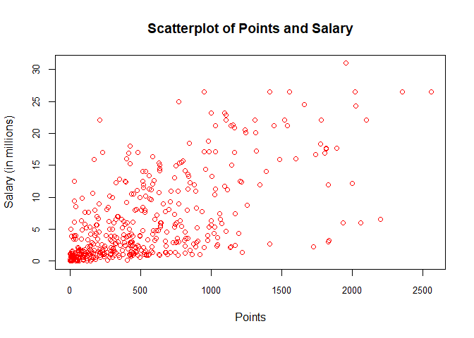
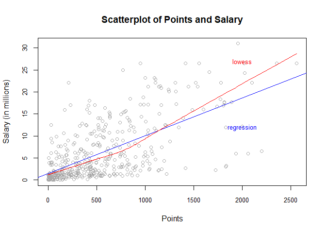
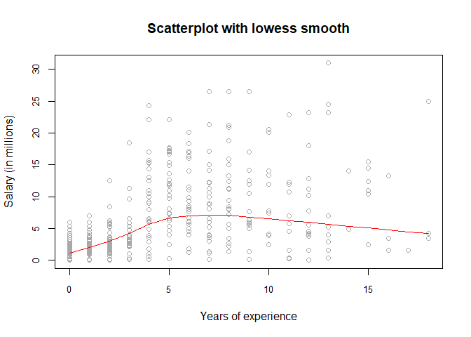
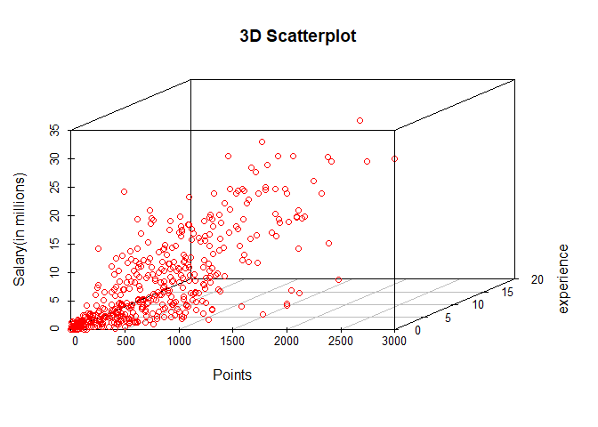
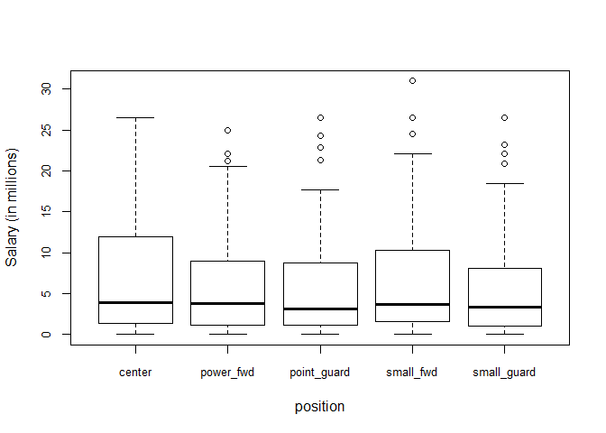

hw01
================
Eriko Funasato
September 21, 2017

``` r
#load the data
load("C:/Users/eriko/stat133/stat133-hws-fall17/hw01/data/nba2017-salary-points.RData")
#list the data
ls()
```

    ## [1] "experience" "player"     "points"     "points1"    "points2"   
    ## [6] "points3"    "position"   "salary"     "team"

1)a bit of data processing
==========================

``` r
millionsalary <- salary*10^-6
round(millionsalary,digits = 2)
```

    ##   [1] 26.54 12.00  8.27  1.45  1.41  6.59  6.29  1.83  4.74  5.00  1.22
    ##  [12]  3.09  3.58  1.91  8.00  7.81  0.02  0.26  0.27  0.01  9.70 12.80
    ##  [23]  1.55  0.54 21.17  5.24 17.64 30.96  2.50 15.33  1.59  7.33  1.58
    ##  [34] 26.54 14.20  0.54  2.70 14.38 12.00  1.92  0.87  5.30  1.20  6.05
    ##  [45] 12.25  3.73 22.12  1.20  1.19  0.54 15.94  5.00 16.96 12.00  7.40
    ##  [56]  5.89  0.54  2.87  3.39  1.50  2.71 23.18  8.40  0.39 15.73  4.00
    ##  [67]  2.50  4.84  1.02 20.07  0.42  3.85  2.28  3.00 17.10  5.37  1.55
    ##  [78] 12.52 15.20  0.92  9.61  1.40 10.50  1.81  6.35  2.57  2.37  2.70
    ##  [89] 10.23  4.58  0.65  8.80  1.05  1.80  4.00  4.00 10.77  2.46 18.31
    ## [100]  1.05 14.15  3.49  1.45  2.11  0.87  2.09 23.20  1.02  1.64 17.55
    ## [111]  1.71  3.18  5.78  0.75 14.00 13.22  2.90 15.89 22.12  4.00  5.78
    ## [122]  0.87  2.59  1.23  0.21  0.54  5.63  4.00  6.00  1.02 22.12  6.50
    ## [133]  1.55  7.00  0.87  1.70  6.00 10.99  3.68  4.62  0.65  2.26 14.96
    ## [144]  2.97 17.20  1.05  0.10  0.87  5.32  2.73  6.51  0.16 12.00  6.33
    ## [155] 12.25 13.00 12.50 20.87  6.00  0.54 24.56  0.14 11.24 21.32 17.00
    ## [166]  1.02  4.32  3.90  6.19  0.54  0.54  2.90  0.54  1.41  1.38  4.35
    ## [177] 17.00  5.00  7.25  0.98  2.61 17.00 15.00  6.54  0.03  3.91 11.75
    ## [188]  0.03  0.95 10.00  0.03  2.32  9.00  4.79  9.42  4.83  1.51  2.99
    ## [199]  1.03  1.02  8.00  0.09  0.87  8.55  1.33  6.09  0.12 21.17  1.56
    ## [210]  1.07 11.48  0.98  3.00  3.33  1.79  2.50  1.40  0.98  0.73  9.25
    ## [221] 11.13  1.17  1.55 15.33  1.02  0.98  1.40 26.54  1.18 16.66  0.38
    ## [232]  0.54  5.78 12.11  2.90  0.54 10.00  1.55  0.54  1.18  2.90  0.17
    ## [243]  0.87 17.64  1.19 20.58 14.00  3.58 15.50 14.45  0.68  0.54  1.30
    ## [254] 12.39  0.26 26.54  0.54  7.00  1.00  6.00 18.74  1.72  7.81  0.15
    ## [265]  1.32 11.00 20.14  1.55  1.27 22.87 21.17  0.54  7.38 13.25  2.20
    ## [276]  1.40  3.50  1.55  5.63 10.15  7.00  3.94 11.05  8.00 16.07  1.02
    ## [287]  2.25 11.00  0.60  0.94  1.41  2.12  2.43  2.34  5.99  2.18  2.44
    ## [298]  2.48 17.15  0.98  1.19  4.84  3.75  0.25 26.54  0.54  3.14  8.95
    ## [309]  6.55  0.94  5.70 22.12  1.37  2.90  0.98  1.29 21.17 26.54  5.51
    ## [320]  3.33  4.26  1.79  0.08 10.36  7.68 18.50  3.22 24.33  6.67 16.39
    ## [331]  0.60  1.92  8.99  9.21  2.75  0.87  1.35  0.54 15.05  8.07  3.24
    ## [342]  1.66  3.21  4.54  1.99 12.08  1.63  2.33  3.50  1.36  5.00  3.53
    ## [353] 11.20  4.60 22.12  0.02  0.54  2.98 16.96  0.58  8.08  0.17 11.29
    ## [364]  9.90  0.06 11.24  2.09  0.65  1.02  4.23 25.00  0.54  8.38 22.12
    ## [375]  4.10  0.06  4.38  0.54  0.87  2.90 17.10  0.21  8.00 12.50  4.01
    ## [386]  3.52  5.23  8.00  2.20  8.05  5.20  1.44 13.33  1.19  1.32 10.66
    ## [397]  3.55  2.02  6.01  3.50  7.64  2.35  3.91  5.96  3.87  3.80  0.14
    ## [408] 13.55  3.05  1.34  2.24  5.28  7.60  5.33  0.07  1.03 12.50  3.27
    ## [419]  1.21 18.00  1.55  5.44  6.19  1.05 16.00  1.73  0.87  4.82 12.61
    ## [430]  0.54  2.22  4.28  0.02 14.00 10.47  4.00  2.94  0.28  2.13  0.92
    ## [441] 12.41

``` r
#replace "r" in exp to o
experience[which(experience=='R')] <- 0
Experience <- strtoi(experience)
```

``` r
#factor variable position
Position <- as.factor(position)
levels(Position)
```

    ## [1] "C"  "PF" "PG" "SF" "SG"

``` r
Position <- factor(position,labels = c("center","power_fwd","point_guard","small_fwd","small_guard"))
table(Position)
```

    ## Position
    ##      center   power_fwd point_guard   small_fwd small_guard 
    ##          89          89          85          83          95

2)scatterplot of points and salary
==================================

``` r
plot(points,millionsalary,main = 'Scatterplot of Points and Salary',col='red',xlab = 'Points', ylab='Salary (in millions)',cex.axis=0.8)
```



3)Correlation between points and salary
=======================================

``` r
n <- length(player)
xbar <- sum(points)/n
ybar <- sum(salary)/n
var_x <- sum((points-xbar)^2)/(n-1)
var_y <- sum((salary-ybar)^2)/(n-1)
sd_x <- sqrt(var_x)
sd_y <- sqrt(var_y)
cov_xy <- sum((points-xbar)*(salary-ybar))/(n-1)
cor_xy <- cov_xy/(sd_x*sd_y)
```

4)Simple linear regression
==========================

``` r
b1 <- cor_xy * sd_y/sd_x
b0 <- ybar-b1*xbar
y_hat <- b0 + b1 * points
summary(y_hat)
```

    ##     Min.  1st Qu.   Median     Mean  3rd Qu.     Max. 
    ##  1509886  2844728  5206372  6187014  8184097 23397875

Y\_hat = b0 + b1\*x

``` r
y_hat[points==0]
```

    ## [1] 1509886

``` r
y_hat[points==100]
```

    ## [1] 2365554

``` r
y_hat[points==500]
```

    ## numeric(0)

``` r
y_hat[points==1000]
```

    ## numeric(0)

``` r
y_hat[points==2000]
```

    ## numeric(0)

5)plotting the regression line
==============================

``` r
#add line 
plot(points,millionsalary,main = 'Scatterplot of Points and Salary',col='dark grey',xlab = 'Points', ylab='Salary (in millions)',cex.axis=0.8)
abline(lm(millionsalary~points),col='blue')
lines(lowess(points,millionsalary),col='red')
text(2000,27,labels = 'lowess',col='red',cex = 0.8)
text(2000,12,labels = 'regression',cex = 0.8, col='blue')
```



6)regression of residuals and coefficient of determination
==========================================================

``` r
e <- salary - y_hat
summary(e)
```

    ##      Min.   1st Qu.    Median      Mean   3rd Qu.      Max. 
    ## -14190304  -2793926  -1094918         0   2555173  18809961

``` r
RSS <- sum(e^2)
TSS <- sum((salary-ybar)^2)
coeff_det <- 1-RSS/TSS
```

7)exploring position and experience
===================================

``` r
#scatterplot
plot(Experience,millionsalary,main = 'Scatterplot with lowess smooth',col='dark grey', xlab = 'Years of experience',ylab = 'Salary (in millions)',cex.axis=0.8)
lines(lowess(Experience,millionsalary),col='red')
```



``` r
#3d scatterplot
library(scatterplot3d)
scatterplot3d(points,Experience,millionsalary,xlab = 'Points',ylab = 'experience',zlab = 'Salary(in millions)',main = '3D Scatterplot',color = 'red',cex.axis = 0.8)
```



``` r
#boxplot
boxplot(millionsalary~Position, xlab='position',ylab='Salary (in millions)',cex.axis=0.8)
```



``` r
#In the scatterplot, the plot are spreaded very wide and average. though the salary for the experience lower than 3 is low, the graph seems to be uniform.Therefore, the salary doesn't seems to be very related with experience. 
#the median of the 5 positiona are about the same.But besides the position of center, the rest four all have outliers. And the center seems to have more population above the median. it seems that the position 'center' have more salary.
```

8)Comments and reflection
=========================

The whole process of doing this homework was struggling, but it is eexcited when come out with the right things. The graphing and plotting part took most of the time. I do need help doing this homework, and most of the help are from google and '?'.Though I don't have coding experience,I am now become a little more confident of coding with R studio.Thank you very much!
