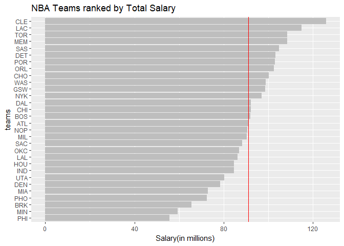
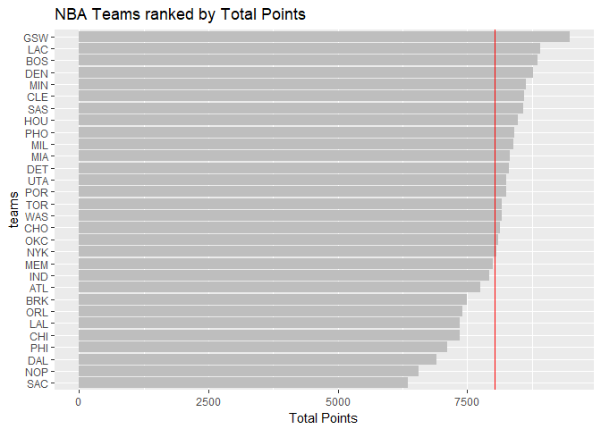
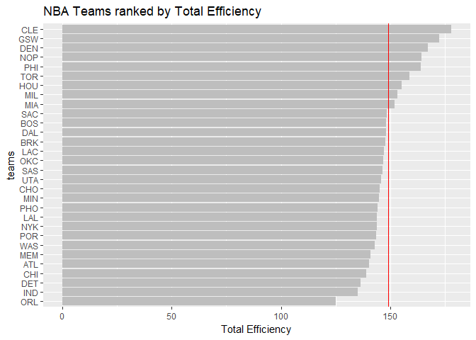
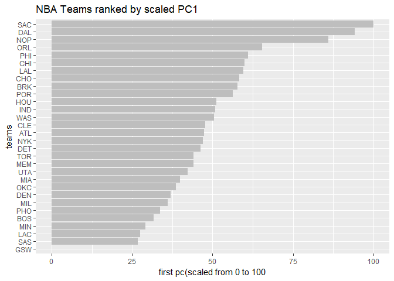

hw03
================
Eriko Funasato
October 15, 2017

``` r
library(dplyr)
```

    ## Warning: package 'dplyr' was built under R version 3.4.2

    ## 
    ## Attaching package: 'dplyr'

    ## The following objects are masked from 'package:stats':
    ## 
    ##     filter, lag

    ## The following objects are masked from 'package:base':
    ## 
    ##     intersect, setdiff, setequal, union

``` r
dat1 <- read.csv("../data/nba2017-roster.csv")
dat2 <- read.csv("../data/nba2017-stats.csv")

#Adding new variables
dat2 <- mutate(dat2,missed_fg=dat2$field_goals_atts - dat2$field_goals_made, 
               missed_ft=dat2$points1_atts-dat2$points1_made,
               points= 3*dat2$points3_made +2*dat2$points2_made+dat2$points1_made,
               rebounds = dat2$off_rebounds + dat2$def_rebounds,
               efficiency= (points+rebounds+dat2$assist+dat2$steals+
                              dat2$blocks- missed_fg - missed_ft - dat2$turnovers)
               /dat2$games_played)
sink(file = "../output/efficiency-summary.txt")
summary(dat2)
```

    ##              player     games_played      minutes     field_goals_made
    ##  A.J. Hammons   :  1   Min.   : 1.00   Min.   :   8   Min.   :  0.0   
    ##  Aaron Brooks   :  1   1st Qu.:32.00   1st Qu.: 475   1st Qu.: 59.0   
    ##  Aaron Gordon   :  1   Median :62.00   Median :1193   Median :161.0   
    ##  Adreian Payne  :  1   Mean   :53.71   Mean   :1244   Mean   :202.2   
    ##  Al-Farouq Aminu:  1   3rd Qu.:75.00   3rd Qu.:1955   3rd Qu.:295.0   
    ##  Al Horford     :  1   Max.   :82.00   Max.   :3048   Max.   :824.0   
    ##  (Other)        :435                                                  
    ##  field_goals_atts field_goals_perc  points3_made     points3_atts  
    ##  Min.   :   1.0   Min.   :0.0000   Min.   :  0.00   Min.   :  0.0  
    ##  1st Qu.: 134.0   1st Qu.:0.4040   1st Qu.:  3.00   1st Qu.: 12.0  
    ##  Median : 361.0   Median :0.4480   Median : 32.00   Median : 96.0  
    ##  Mean   : 440.8   Mean   :0.4507   Mean   : 49.71   Mean   :138.4  
    ##  3rd Qu.: 646.0   3rd Qu.:0.4950   3rd Qu.: 78.00   3rd Qu.:220.0  
    ##  Max.   :1941.0   Max.   :0.7500   Max.   :324.00   Max.   :789.0  
    ##                                                                    
    ##   points3_perc     points2_made    points2_atts     points2_perc   
    ##  Min.   :0.0000   Min.   :  0.0   Min.   :   0.0   Min.   :0.0000  
    ##  1st Qu.:0.2780   1st Qu.: 39.0   1st Qu.:  86.0   1st Qu.:0.4500  
    ##  Median :0.3410   Median :111.0   Median : 228.0   Median :0.4920  
    ##  Mean   :0.3101   Mean   :152.5   Mean   : 302.5   Mean   :0.4898  
    ##  3rd Qu.:0.3790   3rd Qu.:213.0   3rd Qu.: 434.0   3rd Qu.:0.5380  
    ##  Max.   :1.0000   Max.   :730.0   Max.   :1421.0   Max.   :0.8000  
    ##  NA's   :31                                        NA's   :1       
    ##   points1_made     points1_atts    points1_perc     off_rebounds   
    ##  Min.   :  0.00   Min.   :  0.0   Min.   :0.0000   Min.   :  0.00  
    ##  1st Qu.: 21.00   1st Qu.: 29.0   1st Qu.:0.6880   1st Qu.: 12.00  
    ##  Median : 58.00   Median : 77.0   Median :0.7670   Median : 33.00  
    ##  Mean   : 92.47   Mean   :119.4   Mean   :0.7427   Mean   : 52.29  
    ##  3rd Qu.:120.00   3rd Qu.:159.0   3rd Qu.:0.8320   3rd Qu.: 68.00  
    ##  Max.   :746.00   Max.   :881.0   Max.   :1.0000   Max.   :345.00  
    ##                                   NA's   :6                        
    ##   def_rebounds      assists          steals           blocks      
    ##  Min.   :  1.0   Min.   :  0.0   Min.   :  0.00   Min.   :  0.00  
    ##  1st Qu.: 55.0   1st Qu.: 27.0   1st Qu.: 13.00   1st Qu.:  5.00  
    ##  Median :142.0   Median : 74.0   Median : 33.00   Median : 15.00  
    ##  Mean   :171.7   Mean   :117.8   Mean   : 39.68   Mean   : 24.51  
    ##  3rd Qu.:236.0   3rd Qu.:156.0   3rd Qu.: 57.00   3rd Qu.: 32.00  
    ##  Max.   :817.0   Max.   :906.0   Max.   :157.00   Max.   :214.00  
    ##                                                                   
    ##    turnovers          fouls         missed_fg        missed_ft     
    ##  Min.   :  0.00   Min.   :  0.0   Min.   :   1.0   Min.   :  0.00  
    ##  1st Qu.: 22.00   1st Qu.: 42.0   1st Qu.:  75.0   1st Qu.:  7.00  
    ##  Median : 56.00   Median :104.0   Median : 194.0   Median : 18.00  
    ##  Mean   : 68.95   Mean   :101.8   Mean   : 238.6   Mean   : 26.96  
    ##  3rd Qu.: 98.00   3rd Qu.:150.0   3rd Qu.: 344.0   3rd Qu.: 35.00  
    ##  Max.   :464.00   Max.   :263.0   Max.   :1117.0   Max.   :220.00  
    ##                                                                    
    ##      points          rebounds      efficiency    
    ##  Min.   :   0.0   Min.   :   1   Min.   :-0.600  
    ##  1st Qu.: 156.0   1st Qu.:  73   1st Qu.: 5.452  
    ##  Median : 432.0   Median : 178   Median : 9.090  
    ##  Mean   : 546.6   Mean   : 224   Mean   :10.137  
    ##  3rd Qu.: 780.0   3rd Qu.: 307   3rd Qu.:13.247  
    ##  Max.   :2558.0   Max.   :1116   Max.   :33.840  
    ## 

``` r
sink()
#Merging Tables
dat <- merge(dat1,dat2)
colnames(dat)[20] <- "free_throws"

#Creating nba2017-teams.csv
team <- summarize(group_by(dat,team),Experience=round(sum(experience),digits = 2),
                  Salary=sum(round(salary*(10^-6),digits = 2)),
                  Points3=sum(points3_made),Points2=sum(points2_made),
                  Free_throws=sum(free_throws),Points=sum(points),
                  Off_rebounds=sum(off_rebounds),Def_rebounds=sum(def_rebounds),
                  Assists=sum(assists),Steals=sum(steals),Blocks=sum(blocks),
                  Turnovers=sum(turnovers),Fouls=sum(fouls),
                  Efficiency=sum(efficiency))
```

Ranking of Teams
================

``` r
library(ggplot2)
```

    ## Warning: package 'ggplot2' was built under R version 3.4.2

``` r
#Basic Rankings
#Use ggplot() to create a barchart (horizontally oriented) The vertical red line is the average team salary.
ggplot(data=team,aes(x=reorder(team,Salary),y=Salary))+geom_bar(stat='identity',fill='grey')+coord_flip()+geom_hline(aes(yintercept=90.95),col='red')+labs(y="Salary(in millions)")+labs(x="teams")+ggtitle("NBA Teams ranked by Total Salary")
```



``` r
#Create another bar chart of teams ranked by total points. The vertical red line is the average team points
ggplot(data=team,aes(x=reorder(team,Points),y=Points))+geom_bar(stat='identity',fill='grey')+coord_flip()+geom_hline(aes(yintercept=mean(Points)),col='red')+labs(y="Total Points")+labs(x="teams")+ggtitle("NBA Teams ranked by Total Points")
```



``` r
#Use efficiency to obtain a third kind of ranking, and create an associated bar chart of teams ranked by total efficiency. The vertical red line is the average team efficiency.
ggplot(data=team,aes(x=reorder(team,Efficiency),y=Efficiency))+geom_bar(stat='identity',fill='grey')+coord_flip()+geom_hline(aes(yintercept=mean(Efficiency)),col='red')+labs(y="Total Efficiency")+labs(x="teams")+ggtitle("NBA Teams ranked by Total Efficiency")
```



Principal Components Analysis (PCA)
===================================

``` r
#Index based on PC1
PC <- prcomp(team[,2:15],scale=TRUE)
z1 <- PC$x[,1]
s1 <- 100*(z1-min(z1))/(max(z1)-min(z1))
#barchart
ggplot(data=team,aes(x=reorder(team,s1),y=s1))+geom_bar(stat='identity',fill='grey')+coord_flip()+labs(y="first pc(scaled from 0 to 100")+labs(x="teams")+ggtitle("NBA Teams ranked by scaled PC1")
```


