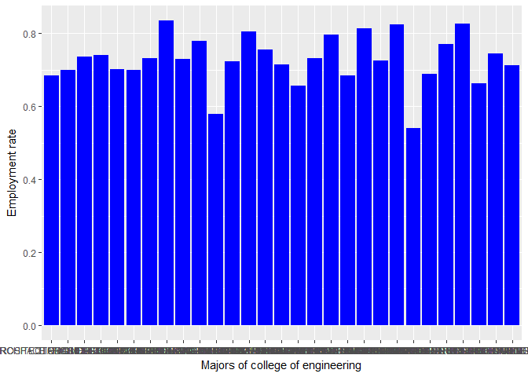

Hypothesis Testing Problem using R
================
Eriko Funasato
October 31, 2017

Introduction
============

In elementary of statistic, we have learnt about hypothesis testing.A statistical hypothesis test is a method of statistical inference. Commonly, two statistical data sets are compared, or a data set obtained by sampling is compared against a synthetic data set from an idealized model([Wikipedia](https://en.wikipedia.org/wiki/Statistical_hypothesis_testing)).We compare one alternative statement against a null hypothesis that is supposed to be true. In hypothesis testing, we determined if alternative claim is true by calculating whether the null hypothesis should be rejected or not. <br><br> In this process, we could introduce terms such as types of errors, significant level, p-value, and some graphs to make us easier to analyze the dataset. In this post, I am going to apply R into hypothesis testing problem by some example using the dataset "earn-of-collegemajors-all-ages"([Github](https://github.com/fivethirtyeight/data/blob/master/college-majors/all-ages.csv)). --import the dataset and packages to be used

``` r
dat <- read.csv("C:/Users/eriko/stat133/stat133-hws-fall17/post01/data/earn-of-collegemajors-all-ages.csv",stringsAsFactors=FALSE)
library(dplyr)
```

    ## Warning: package 'dplyr' was built under R version 3.4.2

    ## 
    ## Attaching package: 'dplyr'

    ## The following objects are masked from 'package:stats':
    ## 
    ##     filter, lag

    ## The following objects are masked from 'package:base':
    ## 
    ##     intersect, setdiff, setequal, union

``` r
library(ggplot2)
```

    ## Warning: package 'ggplot2' was built under R version 3.4.2

``` r
library(BSDA)
```

    ## Warning: package 'BSDA' was built under R version 3.4.2

    ## Loading required package: lattice

    ## 
    ## Attaching package: 'BSDA'

    ## The following object is masked from 'package:datasets':
    ## 
    ##     Orange

``` r
setwd("/Users/eriko/stat133/stat133-hws-fall17/post01")
```

<br><br><br> \#Graphing and Analyze \* Before we start doing a hypothesis testing problem, let's organize the data best fit to be worked in R studio, and do some analysis and graphing process to know more about the dataset. <br><br> \* check the structure of the dataset.

``` r
str(dat)
```

    ## 'data.frame':    173 obs. of  11 variables:
    ##  $ Major_code                   : int  1100 1101 1102 1103 1104 1105 1106 1199 1301 1302 ...
    ##  $ Major                        : chr  "GENERAL AGRICULTURE" "AGRICULTURE PRODUCTION AND MANAGEMENT" "AGRICULTURAL ECONOMICS" "ANIMAL SCIENCES" ...
    ##  $ Major_category               : chr  "Agriculture & Natural Resources" "Agriculture & Natural Resources" "Agriculture & Natural Resources" "Agriculture & Natural Resources" ...
    ##  $ Total                        : int  128148 95326 33955 103549 24280 79409 6586 8549 106106 69447 ...
    ##  $ Employed                     : int  90245 76865 26321 81177 17281 63043 4926 6392 87602 48228 ...
    ##  $ Employed_full_time_year_round: int  74078 64240 22810 64937 12722 51077 4042 5074 65238 39613 ...
    ##  $ Unemployed                   : int  2423 2266 821 3619 894 2070 264 261 4736 2144 ...
    ##  $ Unemployment_rate            : num  0.0261 0.0286 0.0302 0.0427 0.0492 ...
    ##  $ Median                       : int  50000 54000 63000 46000 62000 50000 63000 52000 52000 58000 ...
    ##  $ P25th                        : int  34000 36000 40000 30000 38500 35000 39400 35000 38000 40500 ...
    ##  $ P75th                        : num  80000 80000 98000 72000 90000 75000 88000 75000 75000 80000 ...

<br><br> \* Rename the columns The name of columns in the dataset is too long and complicated, it is better to replace them by shorter abbreviation.

``` r
#replace the major_category's name and column name
colnames(dat) <- c("major_code","major","major_cat","total","employed","employed_fulltime","unemployed","unemployed_rate","median","q1","q3")
```

<br><br> \* Add column of employment rate

``` r
dat <- mutate(dat,employed_rate = dat$employed/dat$total)
```

<br><br> \* Picking data of "Computers & Mathematics"and "engineering"

``` r
#Create new dataframes of category of "Computers & Mathematics"and "engineering"
cs_math <- filter(dat,dat$major_cat=="Computers & Mathematics")
engin <- filter(dat,dat$major_cat=="Engineering")
#store to data file
write.csv(cs_math,file = "C:/Users/eriko/stat133/stat133-hws-fall17/post01/data/cs_math.csv")
write.csv(engin,file = "C:/Users/eriko/stat133/stat133-hws-fall17/post01/data/engin.csv")
```

<br><br> \* summary of data of "Computers & Mathematics"and "engineering"

``` r
#store the result in output file
sink(file = "/Users/eriko/stat133/stat133-hws-fall17/post01/output/cs_math-summary.txt")
summary(cs_math)
```

    ##    major_code      major            major_cat             total       
    ##  Min.   :2001   Length:11          Length:11          Min.   :  7184  
    ##  1st Qu.:2102   Class :character   Class :character   1st Qu.: 27062  
    ##  Median :2106   Mode  :character   Mode  :character   Median : 51771  
    ##  Mean   :2703                                         Mean   :161944  
    ##  3rd Qu.:3700                                         3rd Qu.:165794  
    ##  Max.   :4005                                         Max.   :783292  
    ##     employed      employed_fulltime   unemployed    unemployed_rate  
    ##  Min.   :  5874   Min.   :  5039    Min.   :  150   Min.   :0.02490  
    ##  1st Qu.: 20818   1st Qu.: 16608    1st Qu.: 1702   1st Qu.:0.05237  
    ##  Median : 44071   Median : 35954    Median : 2748   Median :0.05565  
    ##  Mean   :128237   Mean   :106380    Mean   : 7270   Mean   :0.05944  
    ##  3rd Qu.:142321   3rd Qu.:123777    3rd Qu.: 8277   3rd Qu.:0.06687  
    ##  Max.   :656372   Max.   :561052    Max.   :34196   Max.   :0.09026  
    ##      median            q1              q3         employed_rate   
    ##  Min.   :50000   Min.   :34500   Min.   : 75000   Min.   :0.6490  
    ##  1st Qu.:57500   1st Qu.:40000   1st Qu.: 82500   1st Qu.:0.7853  
    ##  Median :66000   Median :43000   Median : 95000   Median :0.8177  
    ##  Mean   :66273   Mean   :43427   Mean   : 95818   Mean   :0.8017  
    ##  3rd Qu.:70000   3rd Qu.:46600   3rd Qu.:103500   3rd Qu.:0.8446  
    ##  Max.   :92000   Max.   :53000   Max.   :136000   Max.   :0.8600

``` r
sink()
sink(file = "/Users/eriko/stat133/stat133-hws-fall17/post01/output/summary-engin.txt")
summary(engin)
```

    ##    major_code      major            major_cat             total       
    ##  Min.   :1401   Length:29          Length:29          Min.   :  6264  
    ##  1st Qu.:2406   Class :character   Class :character   1st Qu.: 18347  
    ##  Median :2413   Mode  :character   Mode  :character   Median : 37382  
    ##  Mean   :2490                                         Mean   :123311  
    ##  3rd Qu.:2499                                         3rd Qu.:138366  
    ##  Max.   :5008                                         Max.   :671647  
    ##     employed      employed_fulltime   unemployed    unemployed_rate  
    ##  Min.   :  4120   Min.   :  3350    Min.   :    0   Min.   :0.00000  
    ##  1st Qu.: 12876   1st Qu.:  9226    1st Qu.:  617   1st Qu.:0.04384  
    ##  Median : 27275   Median : 22104    Median : 1521   Median :0.04985  
    ##  Mean   : 90413   Mean   : 76414    Mean   : 5048   Mean   :0.05063  
    ##  3rd Qu.:101273   3rd Qu.: 85014    3rd Qu.: 5498   3rd Qu.:0.05882  
    ##  Max.   :489965   Max.   :422317    Max.   :26064   Max.   :0.08599  
    ##      median             q1              q3         employed_rate   
    ##  Min.   : 60000   Min.   :40000   Min.   : 82000   Min.   :0.5413  
    ##  1st Qu.: 67000   1st Qu.:46900   1st Qu.: 96000   1st Qu.:0.7001  
    ##  Median : 75000   Median :50000   Median :102000   Median :0.7295  
    ##  Mean   : 77759   Mean   :52459   Mean   :108534   Mean   :0.7278  
    ##  3rd Qu.: 85000   3rd Qu.:60000   3rd Qu.:116000   3rd Qu.:0.7702  
    ##  Max.   :125000   Max.   :75000   Max.   :210000   Max.   :0.8351

``` r
sink()
```

<br><br> \* Plot and store employment rate of each dataframe

``` r
ggplot(cs_math)+geom_col(aes(x=major,y=employed_rate),color=NA,fill="pink")+labs(x="Majors of computer science and math",y="Employment rate")
```


``` r
ggplot(engin)+geom_col(aes(x=major,y=employed_rate),color=NA,fill="blue")+labs(x="Majors of college of engineering",y="Employment rate")
```



``` r
#save
pdf(file = "C:/Users/eriko/stat133/stat133-hws-fall17/post01/image/csmath-ggplot.pdf")
ggplot(cs_math)+geom_col(aes(x=major,y=employed_rate),color=NA,fill="pink")+labs(x="Majors of computer science and math",y="Employment rate")
dev.off()
```

    ## png 
    ##   2

``` r
#save
pdf(file = "C:/Users/eriko/stat133/stat133-hws-fall17/post01/image/engin-ggplot.pdf")
ggplot(engin)+geom_col(aes(x=major,y=employed_rate),color=NA,fill="blue")+labs(x="Majors of college of engineering",y="Employment rate")
dev.off()
```

    ## png 
    ##   2

<br><br><br><br> \# Hypothesis \* To build up my own hypothesis testing problem, I would like to compare which one of "Computer science & math" and "Engineering" has higher income salary, since I was wondering for a long time if which of the field is paid more. <br><br> \* But to compare the income salary by hypothesis test, I need the mean and standard deviation of the datasets. <br><br>
\* To get the mean and sd, here is the formula ([Wan et al.(2014)](https://bmcmedresmethodol.biomedcentral.com/articles/10.1186/1471-2288-14-135)),

<br>$\\bar{x}=\\frac{q1+m+q3}{3}$ <br><br>$S=\\frac{q3???q1}{1.35}$ <br><br>where q1 is first quartile, m is the median, q3 is the third quartile + Add the mean and standard deviation to each datasets

``` r
cs_math <- mutate(cs_math,mean=(q3+median+q1)/3,std=(q3-q1)/1.35)
engin <- mutate(engin,mean=(q3+median+q1)/3,std=(q3-q1)/1.35)
```

-   Calculate the mean and the std of whole datasets

``` r
Mean_cs_math <- sum(cs_math$mean * cs_math$total) / sum(cs_math$total)
Mean_engin <- sum(engin$mean * engin$total) / sum(engin$total)
std_cs_math <- mean(cs_math$std)
std_engin <- mean(engin$std)
```

#### Hypothesis: Computer science & math earn more money than the engineering major.

1.  Claim<br> H\_0 (null): mean(cs\_math income)-mean(engineering income) = 0<br/> H\_1 (alternative claim): mean(cs\_math income)-mean(engineering income) &gt; 0
2.  since the number of both independent sample are huge enough, suppose they are approximately normaly distributed. Standard deviation are known by calculation, we could use 2-sample Z-test.
3.  Set the significant value as alpha=0.05, which means confidence level is 0.95
4.  Program calculation

-   Calculate using z.test([RDocumentation](https://www.rdocumentation.org/packages/BSDA/versions/1.2.0/topics/z.test))

``` r
z.test(cs_math$mean,engin$mean, alternative = "greater", mu = 0, sigma.x = std_cs_math,sigma.y = std_engin, conf.level = 0.95)
```

    ## 
    ##  Two-sample z-Test
    ## 
    ## data:  cs_math$mean and engin$mean
    ## z = -0.79045, p-value = 0.7854
    ## alternative hypothesis: true difference in means is greater than 0
    ## 95 percent confidence interval:
    ##  -34129.93        NA
    ## sample estimates:
    ## mean of x mean of y 
    ##  68506.06  79583.91

-   Calculate using t.test([Phil Spector](https://statistics.berkeley.edu/computing/r-t-tests))

``` r
t.test(cs_math$mean,engin$mean,alternative = "greater",conf.level = 0.95)
```

    ## 
    ##  Welch Two Sample t-test
    ## 
    ## data:  cs_math$mean and engin$mean
    ## t = -2.5243, df = 23.49, p-value = 0.9906
    ## alternative hypothesis: true difference in means is greater than 0
    ## 95 percent confidence interval:
    ##  -18592.52       Inf
    ## sample estimates:
    ## mean of x mean of y 
    ##  68506.06  79583.91

1.  Conclusion: fail to reject null

-   For the result of calculation using z-test, p-value=0.7854 is greater than the alpha=0.05, therefore fail to reject the null hypothesis, we don't have enough confidence to say that people who major in "Computer science & math" earn more than "Engineering" major. <br>
-   For the result of calculation using t-test, p-value=0.9906 is greater than the alpha=0.05, therefore fail to reject the null hypothesis, we don't have enough confidence to say that people who major in "Computer science & math" earn more than "Engineering" major. <br>Therefore, we cannot conclude which of the major("CS & Math" and "Engineering") can earn more money after graduate. <br>
-   The difference between the Z-test and t-test is, when the mean of the sample can be known, the standard deviation is unknown, then we use the **t-test** to estimate the population. If the standard deviation is known or calculated, then use **z-test** to do the evaluation. <br><br>

More about hypothesis test.
===========================

-   Not only the problems like the example I give, there are still many kind of hypothesis tesing, such as:<br/>
-   one-sample z-test(left-sided,right-sided,both-sided)
-   one-sample t-test(left-sided,right-sided,both-sided)
-   two-proportion z test(inference of two proportion)
-   two-proportion t-test
-   two-sample t/z-test(inference of two mean)
-   chi-squre test(testinga claim about a standard deviation of population)
-   Goodness-of-fit(test if sample data with k categories is "good fit"to an assumed distribution)
-   One-way Analysis of Variance(ANOVA):test for equality of more than three sample data. <br>
-   And to do these in r, check ([Rtutorial](http://www.r-tutor.com/elementary-statistics/hypothesis-testing))<br/> For the concepts of hypothesis test, see ([Pennstate](https://onlinecourses.science.psu.edu/statprogram/node/139)). <br><br>

Take Home Message!!
===================

PLease try to make some function of t-test or z-test, for one-sample and two-sample.<br/> <br> And try to compare the employment rate and unemployment rate of the majors or the major categories you are interested in. <br><br><br><br> **Thank you for reading my post!!!**
